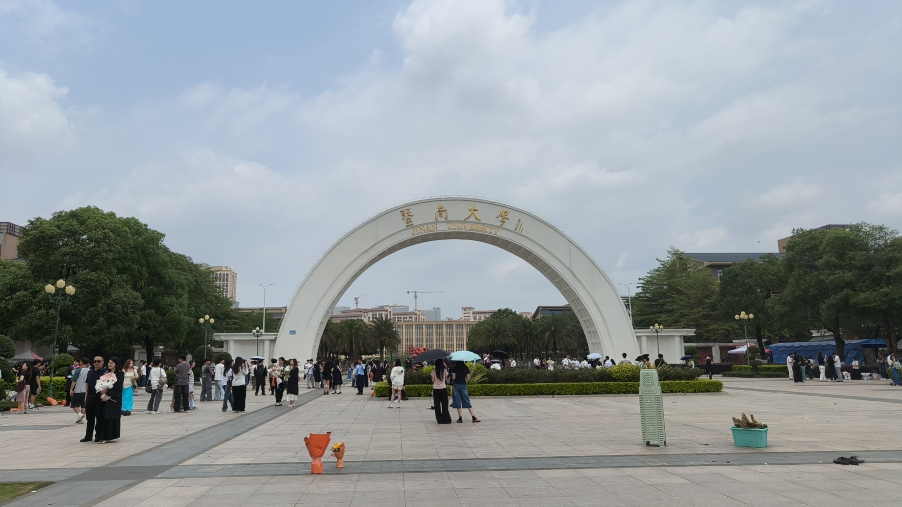
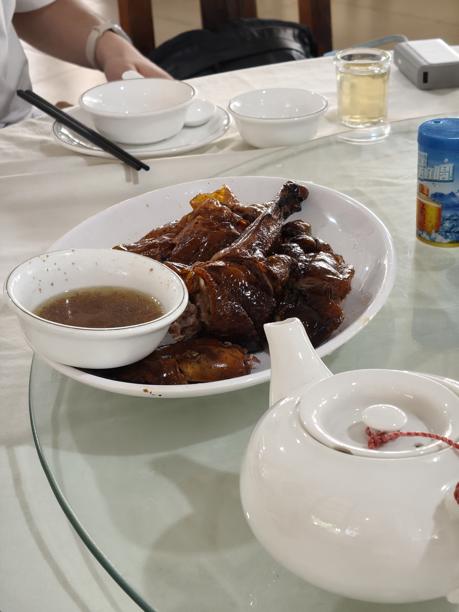
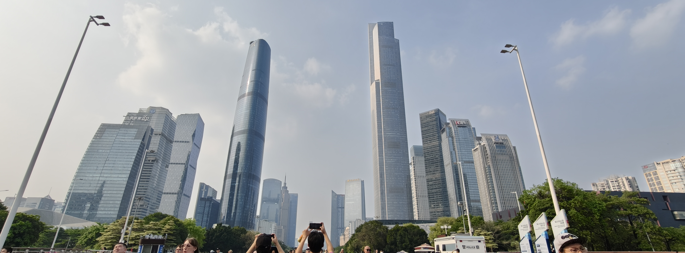
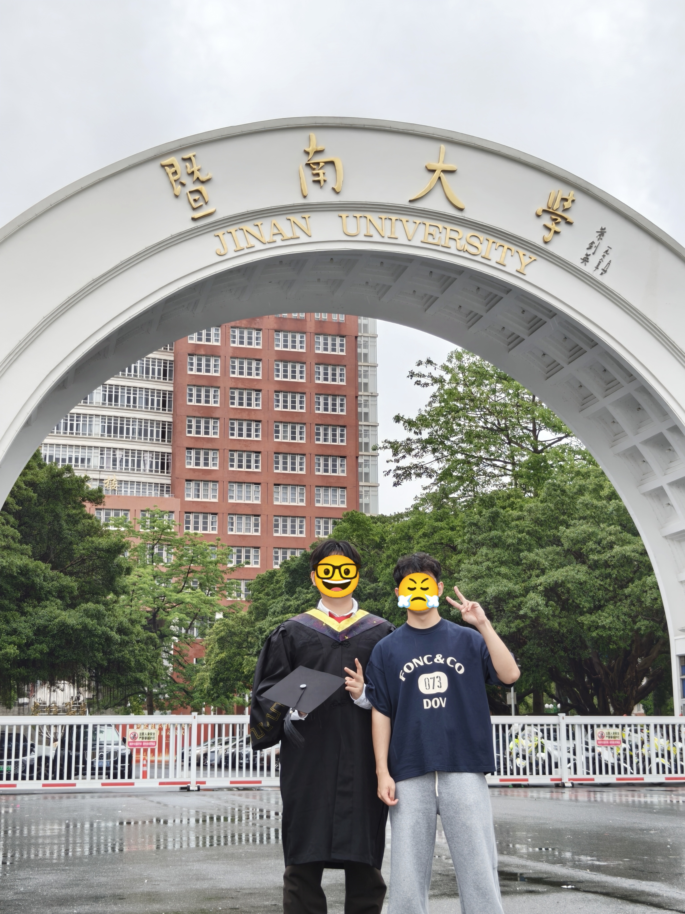
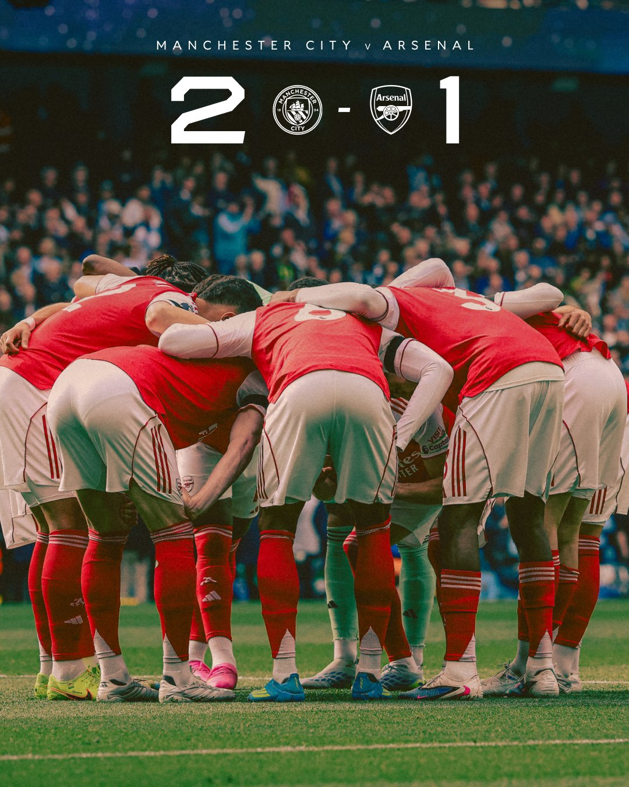

### Topic(1/n) - 广州行

上周去了两趟广州，都是去参加暨南大学朋友毕业照拍摄的。

第一站是暨南大学的番禺校区。学校的建筑风格偏老，但整体比想象中新。下午玩到了体验最好的一次剧本杀，dm水平超级高😆

午饭和晚餐都很好吃，一餐烧鹅一餐猪杂😋

第二天跟着一个大学同学玩了一天，逛了逛几个比较有名的地方。同学很给力，向导加解说了一路😊

而周四再来，就是当天往返。那天天气一般，时不时下雨，就这样还是把毕业照给拍了。

### Topic(2/n) - 阿森纳

看了两场球，其中天王山之战是一个人在广州的酒店看的直播，另一场是周日早上在健身房补的回放。

第一场球看完后想了很多，还写了篇小作文发朋友圈；其实踢得真还可以，也有不少机会。第二场踢的是真一般，但总归是赢了😢。

### Topic(3/n) - 电影《米勒的女孩》

因为马丁主演而看，没想到是这样一部电影。从一开始的跳脱到后面沉浸去感受主角的情绪，不知道电影是怎么把我抓住的。

整个电影塑造了一个神奇的情感场域，一步步推向高潮却又悬宕着收场。只能说是一部荒谬而神奇的电影。

### Topic(4/n) - 生活支线

这两天开始复健了，作息也在慢慢控制；下周准备每天做一些拉伸来慢慢调整体态。

这几天都没有打fps了，是件好事。

### Topic(5/n) - 下周计划

前一阵子忙完了考研复试和导师互选，下周要把重心重新放回工作上。同时继续调整生活上的一些内容，包括饮食、作息和健身锻炼。
