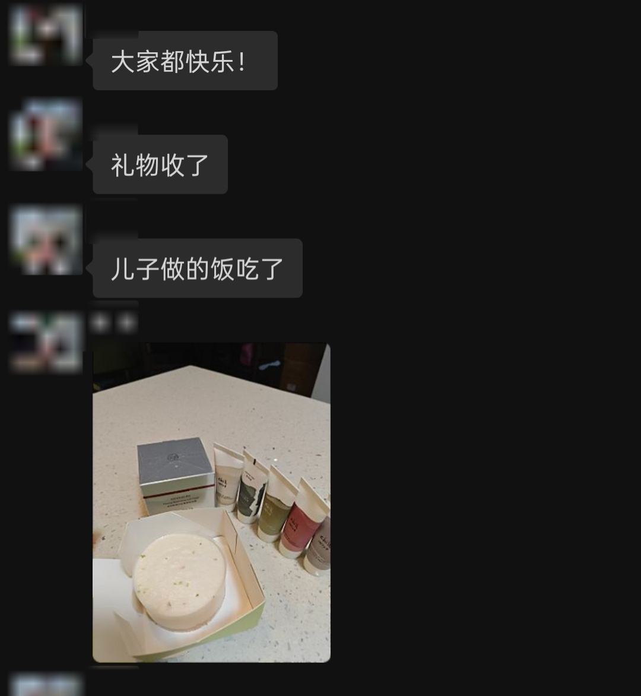
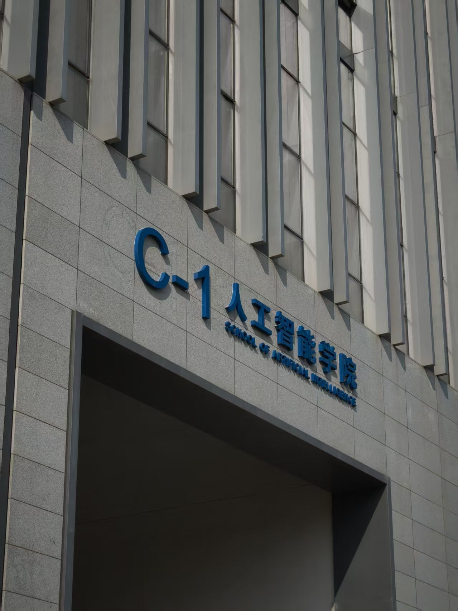
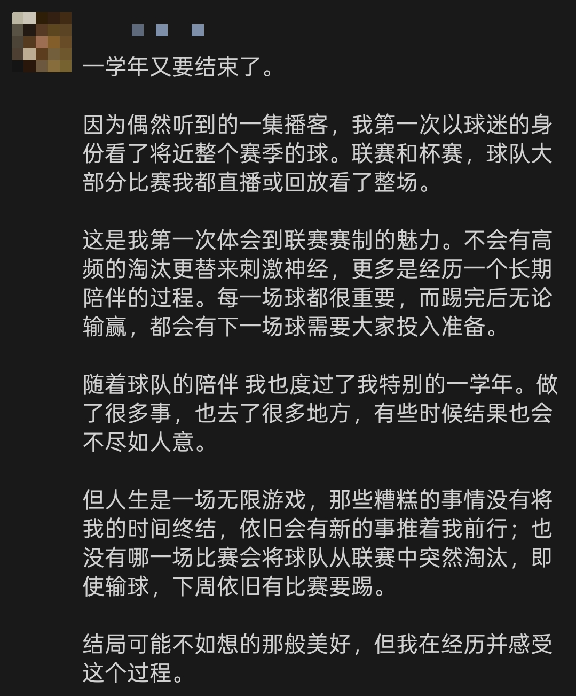

这周回学校了，疯玩了几天，也没写日记，就随便总结一下吧。

### Topic(1/n) - 母亲节

有收入之后的第一个给长辈过的节日，买了一盒护肤品给妈妈，然后美团点了一束小花，然后买了盒预处理的菜来炒。

突然还蛮有压力的，要还一些家里长辈的恩情，时不时要想一下，我不太擅长这些🤦‍

### Topic(2/n) - 毕业答辩

回学校是为了毕业答辩，这篇文章在我考研复试包括导师双选期间已经熟烂于心了，过程蛮轻松的。

见到了好久不见的同学，跟舍友和同学聚了几餐，玩了几天，对我来说是非常混乱的狂欢。

### Topic(3/n) - 阿森纳

现在的每一场比赛都很重要，所以我这几周应该会经常提到；阿森纳又拿下了两场关键的比赛。欧冠晋级决赛，英超进一步拉开分差。

我是这个赛季开始关注的球赛，阿森纳陪伴我度过了考研这一整年。

